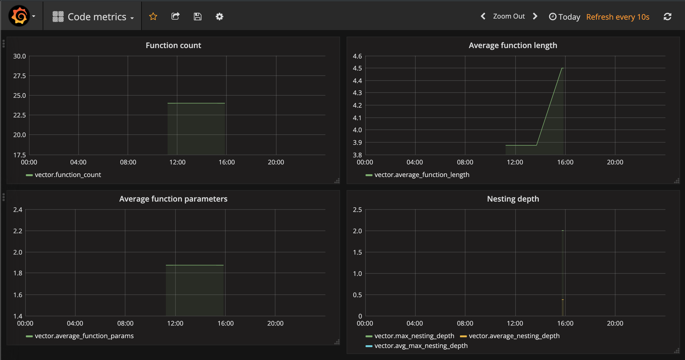

# Code Analysis
Analyzing C source code with python to compile statistics.
The aim is to push these statistics to Graphite/Grafana for visualization.
Using pycparser to parse the code.

Currently following stats are extracted:

|  |  |
| --- | --- |
| max_nesting_depth | The maximum number of nested scopes (if, for, while...) in the code |
| avg_max_nesting_depth | The average deepest nesting level of functions |
| average_nesting_depth | Average nesting level of a code line |
| funcs_with_statics | The count of functions with static variables. To be represented as a ratio of all functions | 
| function_count | Number of defined functions within the source |
| average_function_length | Average length of a function |
| average_function_params | Average number of parameters per function |
| average_variable_count | Average number of variables in a function. Excluding constants and loop variables |
| global_vars | Number of non-constant static or extern global variables | 
| extern_vars | Number of non-constant extern variables |
| file_count | Number of files prcessed |
| functions_without_params | Number of functions without any parameters |
| functions_with_many_params | Number of functions with over 4 parameters |
| long_functions | Number of long functions |
| really_long_functions | Number of really long functions |
